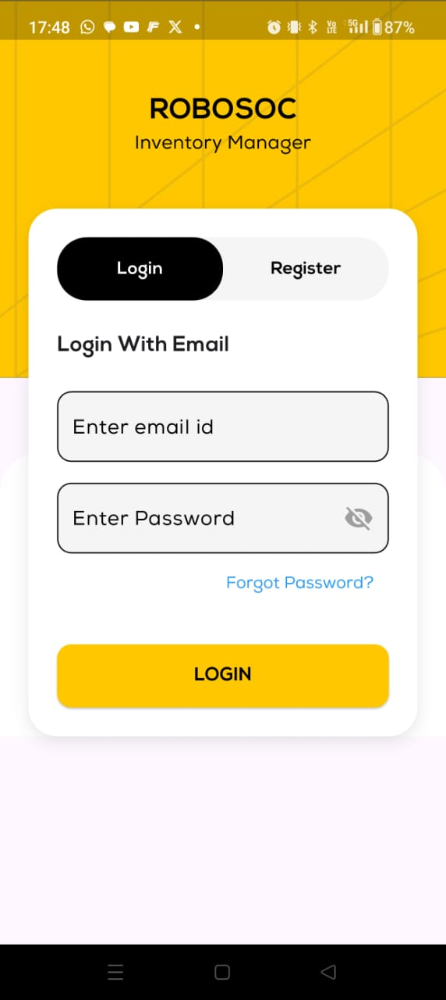
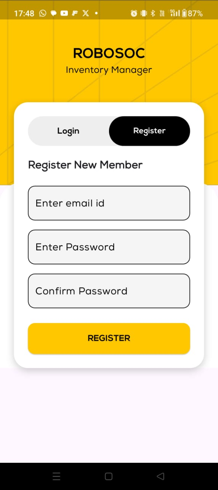
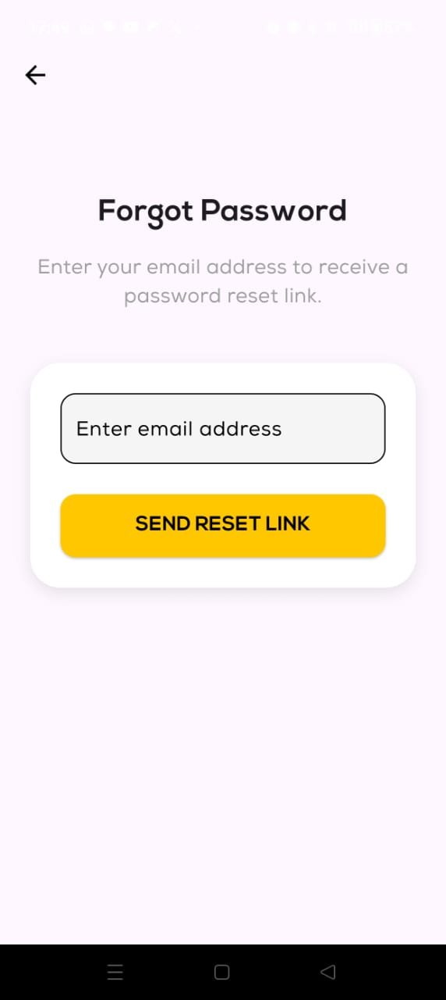
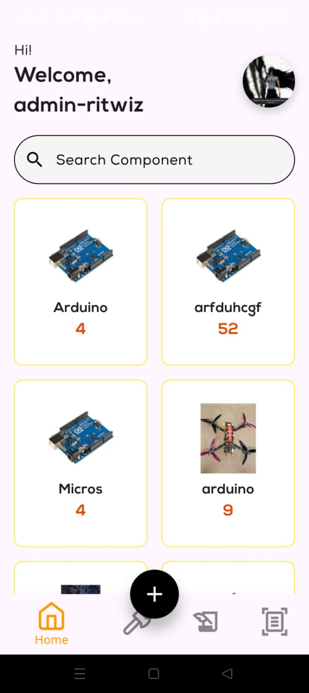
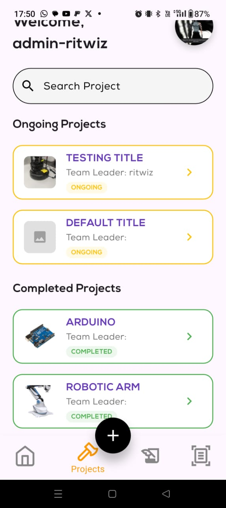
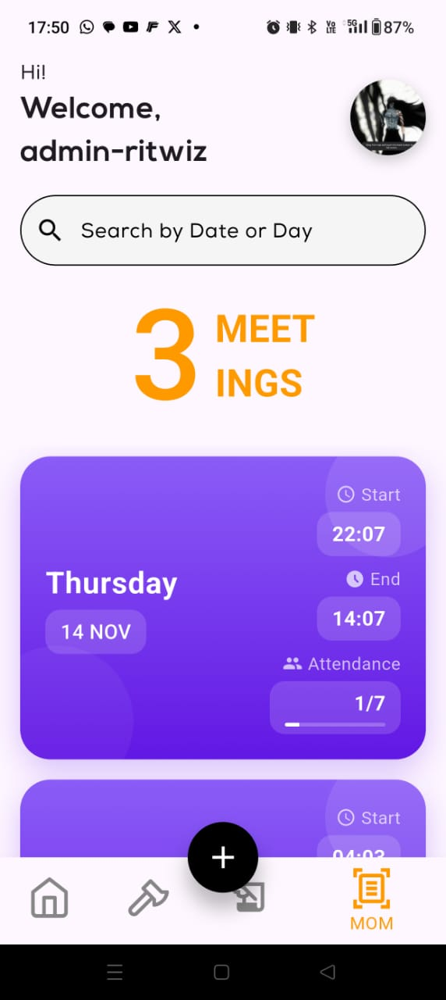

# Robosoc

Robosoc is a Flutter-based application designed for the members of Robotics Society of NITH .

## Features

- **Inventory Management**: [Detailed description of feature 1]
- **Project Management**: [Detailed description of feature 2]
- **Meeting Management**: [Detailed description of feature 3]
- **Components Issuance**: [Detailed description of feature 4]

## Screenshots

Here’s a preview of the application:

<table>
  <tr>
    <td>
      <br>
      <p>Login Page</p>
    </td>
    <td>
      <br>
      <p>Register Page</p>
    </td>
     <td>
      <br>
      <p>Forgot Password Page</p>
    </td>
  </tr>
  <tr style="height: 20px;">
    <td colspan="2"></td>
  </tr>
  <tr>
    <td>
      <br>
      <p>Home Page</p>
    </td>
    <td>
      <br>
      <p>Projects Page</p>
    </td>
     <td>
      <br>
      <p>[MOMs Page</p>
    </td>
  </tr>
</table>


## Getting Started

Follow these instructions to set up and run the project on your local machine.

### Prerequisites

- **Flutter SDK**: Ensure that Flutter is installed on your system. You can download it from the [official Flutter website](https://flutter.dev).
- **Dart SDK**: Included with Flutter, but ensure it's properly configured.
- **IDE**: Visual Studio Code

### Installation

1. **Clone the repository**:

   ```bash
   git clone https://github.com/RITWIZSINGH/Robosoc.git
   
2. **Navigate to the project directory**:

   ```bash
   cd Robosoc
   
3. **Install dependencies**

    ```bash
    flutter pub get

4. **Run the application**

     ```bash
     flutter run


## **Project Structure**

    lib/
    │   constants.dart
    │   main.dart
    │
    ├───mainscreens/
    │   │   navigatation_screen.dart
    │   │
    │   ├───homescreen/
    │   │       add_new_component_screen.dart
    │   │       component_detail_screen.dart
    │   │       home_page.dart
    │   │       notification_screen.dart
    │   │       profile_screen.dart
    │   │
    │   ├───issuehistory/
    │   │       issue_component_screen.dart
    │   │       issue_history.dart
    │   │
    │   ├───login_registerscreen/
    │   │       forgot_password_screen.dart
    │   │       loading_screen.dart
    │   │       login_screen.dart
    │   │       onboarding_screen.dart
    │   │       register_screen.dart
    │   │
    │   ├───momscreen/
    │   │       mom_details_screen.dart
    │   │       mom_page.dart
    │   │       new_mom.dart
    │   │
    │   ├───projects_screen/
    │   │       add_new_project_screen.dart
    │   │       detailed_project_viewscreen.dart
    │   │       projects_page.dart
    │   │
    │   ├───project_updates/
    │   │       add_update_screen.dart
    │   │       view_update_screen.dart
    │   │
    │   └───startscreen/
    │           splash_screen1.dart
    │           splash_screen2.dart
    │           splash_screen3.dart
    │           start_screen.dart
    │
    ├───models/
    │       component.dart
    │       component_model.dart
    │       mom.dart
    │       notification_model.dart
    │       project_model.dart
    │       user_profile.dart
    │
    ├───utilities/
    │       component_provider.dart
    │       custom_container.dart
    │       date_formatter.dart
    │       image_picker.dart
    │       notification_provider.dart
    │       page_transitions.dart
    │       project_provider.dart
    │       role_manager.dart
    │       user_profile_provider.dart
    │       user_profile_service.dart
    │
    └───widgets/
        │   animated_profile_image.dart
        │   edit_profile_form.dart
        │   issued_commponent_card.dart
        │   loading_states.dart
        │   project_card.dart
        │   project_list_item.dart
        │   project_update_card.dart
        │   shimmer_loading.dart
        │   user_image.dart
        │
        ├───mom_card/
        │       card_background.dart
        │       date_section.dart
        │       details_section.dart
        │       detail_item.dart
        │       mom_card.dart
        │
        ├───mom_details/
        │       detail_card.dart
        │       detail_header.dart
        │       detail_section.dart
        │
        ├───mom_form/
        │       form_field.dart
        │
        ├───notifications/
        │       notification_badge.dart
        │
        ├───onboarding_screen/
        │       custom_textfield.dart
        │       onboarding_header.dart
        │       role_selector.dart
        │
        ├───profile/
        │       animated_upload_overlay.dart
        │       issued_component_history_card.dart
        │       profile_form.dart
        │       profile_header.dart
        │       profile_image.dart
        │
        └───view_update_widgets/
                comments_section.dart
                update_description.dart
                update_header.dart

## **Dependencies**

  ```yaml
dependencies:
  flutter:
    sdk: flutter
  cupertino_icons: ^1.0.6
  navigation_utils: ^0.7.3
  firebase_auth: ^5.1.2
  firebase_core: ^3.3.0
  cloud_firestore: ^5.1.0
  firebase_core_web: ^2.17.3
  flutter_svg: ^2.0.10+1
  image_picker: ^1.1.2
  firebase_storage: ^12.1.1
  provider: ^6.1.2
  intl: ^0.19.0
  cached_network_image: ^3.4.1
  flutter_keyboard_visibility: ^6.0.0
  pin_code_fields: ^8.0.1
  url_launcher: ^6.3.1
  lucide_icons: ^0.257.0
